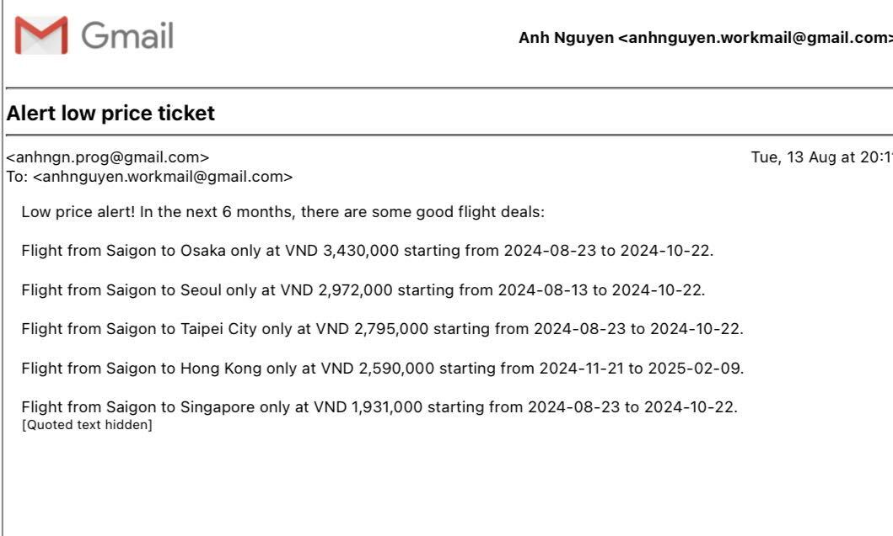

# cheap-flight-alert
Using API to search for the cheapest flight in the next 6 months and alert via email.
## Steps
1. A [Google Sheet](https://docs.google.com/spreadsheets/d/1vfUKNhBbYD4aXNCgAfINAmy-KnnlTpsjdeCK-n-mD1I/edit?gid=0#gid=0) lists down all cities you want to visit and want to keep track price
2. An API from [Sheety](https://sheety.co/) to extract data from Google Sheet
3. Use the extracted data as an input and call API from [Amadeus](https://developers.amadeus.com/self-service/category/flights) to get the lowest price offer in the next 6 months
4. Update the lowest offer and time range for the offer back to Google Sheet
5. Use the lowest offer deducting VND 10,000 to update the search price
4. Set up an email alert when there is a better offer (only when there are new offers that are lower than the search price)
## Expected output
